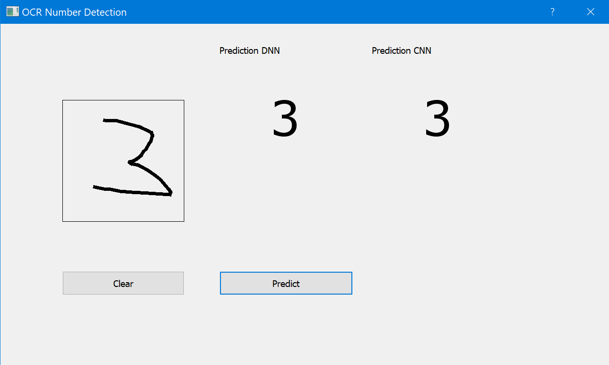
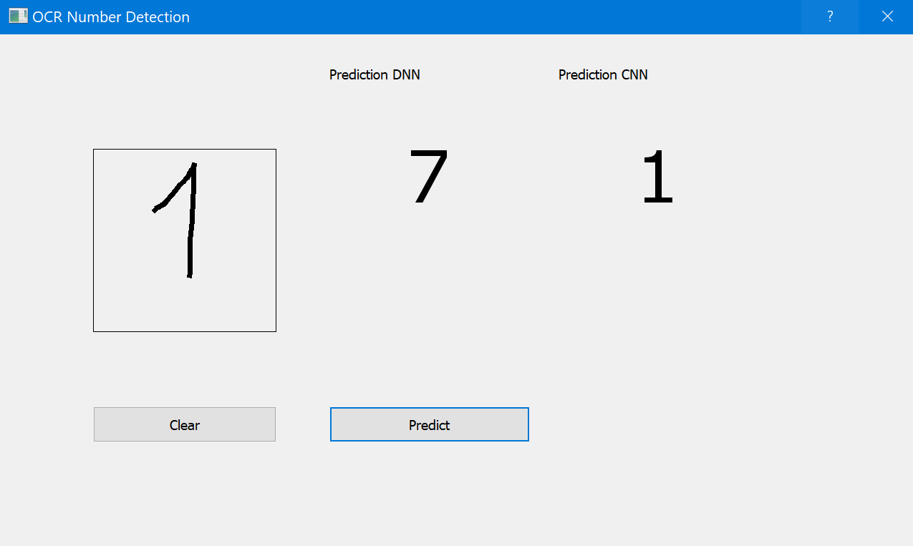

# Deep Learning with Tensorflow, Keras and Python

Software for classifying hand-written digits with a neural network, trained on the mnist dataset ([info](https://keras.io/api/datasets/mnist/)).

The application uses two different neural networks for classifying handwritten digits.

1. Deep Neural Network  (accuracy: ~98,48%)
   - Is using the Tensorflow Sequential-Class
   - Normalizaation with minMax approach
   - Augmentation of a random sample
   - Augmentation and normalization is done without Tensorflows optimized prefetch-mechanism
2. Convutional Neural Network (accuracy: ~99,05%)
   - Is using the tensorflow Base-Model-Class with the Python call-method-approach
   - Normalization and Augmentation with Tensorflow's experimental preprocessing lib
   - Included Tensorboard for further analysis of the model

- `build_and_train_dnn_model` will prepare the [mnist](https://keras.io/api/datasets/mnist/) dataset, create a Sequential-Model and train it with the given data. The model will be saved into the project directory, after the first execution the training isn't necessary anymore.
- `build_and_train_cnn_model` same as for `dn` model. This will take way more time to train the model.
- `application_gui` will open an graphical user interface where you can draw digits on a canvas and predict them within the created model.

## Usage

Run `main.py`

## Requirements

- Anaconda with Python 3.8 [Download](https://www.anaconda.com/download/)
- Tensorflow 2.3+ for Python [Installation](https://www.tensorflow.org/install/)
- pyqt5, opencv-python, numpy, scipy and matplotlib for Python
